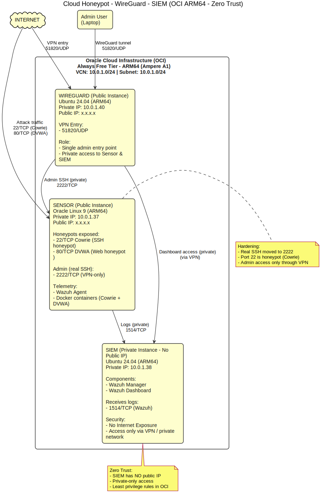
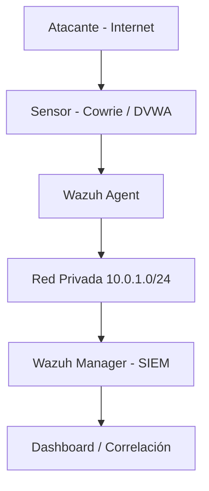

# Cloud-Honeypot-WireGuard-SIEM

## Topología de red

> Diagrama autogenerado desde `diagrams/topologia.puml` mediante GitHub Actions.

---

## 🏗️ Arquitectura implementada

El entorno está desplegado en **3 instancias ARM64 dentro de una VCN privada (10.0.1.0/24)**.

### 1️⃣ Sensor – Honeypots (Nodo expuesto)

- **SO:** Oracle Linux 9 (ARM)
- **IP Pública:** Sí
- **Servicios expuestos:**
  - `22/TCP` → Cowrie (SSH honeypot)
  - `80/TCP` → DVWA (honeypot web)
- **SSH real movido a 2222**
- Wazuh Agent instalado
- Servicios gestionados con Docker Compose

🔐 El puerto 22 no es el SSH real, sino el honeypot.  
La gestión legítima se realiza exclusivamente en el puerto **2222** con autenticación por clave pública.

---

### 2️⃣ SIEM – Wazuh Manager (Nodo aislado)

- **SO:** Ubuntu 24.04 LTS (ARM)
- **IP Pública:** ❌ No
- **Acceso:** Solo por red privada o VPN
- **Función:** Recepción, análisis y correlación de eventos

📌 El SIEM nunca está expuesto a Internet.

---

### 3️⃣ VPN – WireGuard Gateway

- **SO:** Ubuntu 24.04 LTS (ARM)
- **Puerto expuesto:** `51820/UDP`
- **Función:** Punto único de administración segura

Permite:

- Acceso privado a toda la VCN.
- Gestión del SIEM sin exponerlo.
- Separación total entre Internet y capa de análisis.

---

## 🔁 Flujo completo validado

✔ Evento generado  
✔ Registrado en honeypot  
✔ Leído por agente  
✔ Enviado por red privada  
✔ Visualizado en el SIEM  

El ciclo completo fue validado en entorno productivo.

---

## 🔧 Tecnologías utilizadas

### ☁️ Cloud
- Oracle Cloud Infrastructure (VCN, Security Lists)
- VM.Standard.A1.Flex (Ampere ARM64 – Always Free Tier)

### 🖥️ Sistemas
- Oracle Linux 9
- Ubuntu 24.04 LTS

### 🎯 Honeypots
- Cowrie (SSH)
- DVWA (Web vulnerable)

### 📊 Monitorización
- Wazuh (SIEM)
- Ingesta directa de logs Docker

### 🔐 Seguridad
- WireGuard (VPN privada)
- Hardening SSH (22 → 2222)
- Separación gestión vs honeypot
- Segmentación de red
- Control de exposición pública

### ⚙️ DevOps
- Docker
- Docker Compose
- Script personalizado `start-dvwa.sh`
- Backend DVWA migrado a SQLite

---

## ⚙️ Retos técnicos reales superados

### 🔹 Incompatibilidad ARM64 (`exec format error`)
Las imágenes Docker x86_64 no funcionaban en Ampere A1.  
Se utilizaron imágenes compatibles o adaptadas a ARM.

### 🔹 Conflicto de puertos 22 vs 2222
Se movió el SSH real a 2222 para liberar el 22 al honeypot.

### 🔹 Dependencias MySQL en DVWA
Migración a SQLite para:
- Reducir complejidad
- Eliminar dependencias externas
- Facilitar restauraciones limpias

### 🔹 Monitorización de contenedores con Wazuh
Se adoptó un enfoque robusto basado en la ingesta directa de logs desde el host.

---

## 🧱 Modelo de seguridad aplicado

- Principio de mínimo privilegio en Security Lists.
- SIEM sin IP pública.
- Administración exclusivamente mediante VPN.
- Autenticación SSH por clave pública.
- Separación total entre:
  - Servicio real
  - Servicio de engaño
  - Capa de análisis

Arquitectura alineada con principios Zero Trust.

---

## 🧠 Competencias demostradas

- Diseño de arquitectura segura en Cloud pública
- Segmentación real en entorno productivo
- Hardening de servicios expuestos
- Adaptación multi-arquitectura (ARM64)
- Integración Honeypot + SIEM
- Resolución de incompatibilidades reales
- Infraestructura sostenible sin coste operativo
- Gestión completa del ciclo captura → análisis

---

## 💰 Coste del proyecto

- **Infraestructura Cloud:** 0€
- **Licencias:** 0€
- **Software:** 100% Open Source

Se optó deliberadamente por mantener la arquitectura en ARM64 Free Tier en lugar de migrar a instancias x86 de pago, priorizando resolución técnica y sostenibilidad.

---

## 🚀 Reproducción (Resumen técnico)

1. Crear VCN privada en OCI (10.0.1.0/24).
2. Desplegar 3 instancias ARM64.
3. Configurar reglas:
   - 22 (Cowrie)
   - 80 (DVWA)
   - 51820 (WireGuard)
   - 1514 interno (Wazuh)
4. Instalar Docker en el sensor.
5. Desplegar Cowrie + DVWA.
6. Configurar Wazuh Manager.
7. Instalar Wazuh Agent en el sensor.
8. Configurar WireGuard.
9. Validar flujo Sensor → SIEM.

---

## 🏁 Conclusión

Este proyecto demuestra capacidad real para diseñar, implementar y asegurar una infraestructura compleja en cloud pública bajo restricciones reales (ARM64, coste 0€, segmentación estricta).

Arquitectura reproducible.  
Monitorización activa.  
Seguridad aplicada.  
Infraestructura preparada para escalar.
